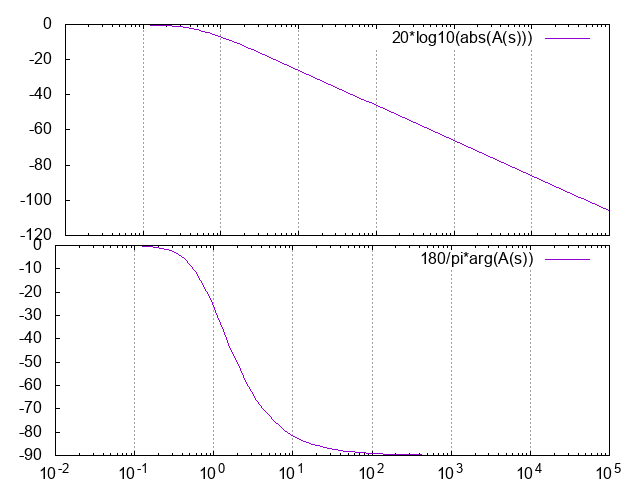

# PlotHelper

|    <b>Dependencies</b>   |
|        ---------         |
|Gnuplot added to PATH     |
|Dart interpreter added to PATH |

* Usage

See examples below

* Options

Depending on the type of graph, optional parameters can be passed, like linewidth, labels, output format...


________

# Examples

* Simplest graph

``` 
main() {
  plot('x^2');
}
```  


Now with some options :
``` 
main() {
	plot('x^2',
		style:Styles.impulses,
		nbPoints:2000,
		color:'purple',
		showGrid:true
	);
}
```


* Multiple plots

``` 
main() {
  multiplot(
    [
      new Plot(
        '1/x',
        style:Styles.steps,
        showGrid:true
      ), 
      new Plot(
        'log(x)',
        style:Styles.impulses,
        color:'red',
        frm:0,
        to:2
      )
    ],
    rows:2
  );
}
``` 


* 3D plot

``` 
main() {
  plot3d(
      'cos(x)*sin(y)',
      palette:Palettes.ocean,
      labels:new Labels(
        xlabel: 'x axis',
        ylabel: 'y axis',
        zlabel: 'z axis',
        title: '3D plot!'
      )
    );
}
``` 


* Plot from a file

``` 
main() {
  plot3d(
    'plt.dat',
    file:true 
  );
}
``` 


* Bode plot

``` 
main() {
  bode('1/(1+p/10)');
}
``` 



``` 
main() {
  bode(
    '(s+1)/((s-1)*(s-2))',
    laplace:'s'		
  );
}
``` 


